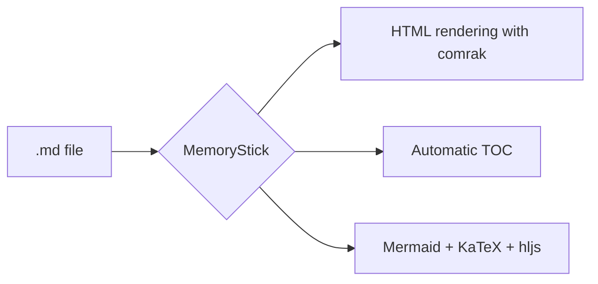

# MemoryStick demo

Welcome to **MemoryStick**, a _complete_ Markdown viewer written in **Rust** with Tauri.

## Formatting

- **bold**, *italic*, ~~strikethrough~~, `inline code`
- [external link](https://example.com)
- Autolink: https://github.com/Project-Colony/MemoryStick

## Task list

- [x] Full GFM support (tables, task lists, strikethrough)
- [x] Syntax highlighting (highlight.js, 36 common languages)
- [x] Math (KaTeX)
- [x] Mermaid diagrams
- [x] Colony themes
- [ ] Coffee ☕

## Code

```rust
fn fibonacci(n: u32) -> u64 {
    match n {
        0 => 0,
        1 => 1,
        _ => fibonacci(n - 1) + fibonacci(n - 2),
    }
}
```

```python
def fibonacci(n):
    a, b = 0, 1
    for _ in range(n):
        yield a
        a, b = b, a + b
```

## Table

| Language   | Score | Remark          |
|------------|:-----:|-----------------|
| French     |  10   | Native language |
| English    |   8   | Fluent          |
| Klingon    |   2   | Getting there   |

## Citation

> Simplicity is the ultimate sophistication.
>
> *Leonardo da Vinci*

## Math

Inline: $E = mc^2$ and $\sum_{i=1}^{n} i = \frac{n(n+1)}{2}$.

Block:

$$
\int_{-\infty}^{\infty} e^{-x^2} \, dx = \sqrt{\pi}
$$

## Mermaid diagram



## Footnote

Here is a reference[^1].

[^1]: And here is the note itself.
